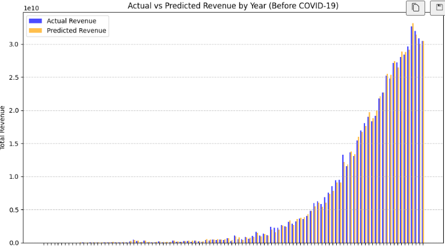
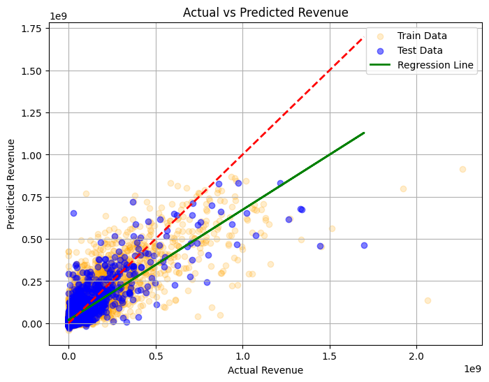

# 🍿 영화 데이터 기반 흥행 분류 및 수익 예측 통합 모델
<br />
<table>
  <thead>
    <td align="center">
      <a href="https://github.com/DawnSurplus">
        <br /><hr/>
        성호진
      </a><br />
    </td>
    <td align="center">
      <a href="https://github.com/Ohjunghh">
        <br /><hr/>
        오정현
      </a><br />
    </td>
    <td align="center">
      <a href="https://github.com/haides8973">
        <br /><hr/>
        이상준
      </a><br />
    </td>
    <td align="center">
      <a href="https://github.com/comet39">
        <br /><hr/>
        이혜성
      </a><br />    
  </thead>
</table>
<br /><br />


# 📊 EDA 리뷰
> | 제작비 - 수익 | 평점 - 수익 | 추천수 - 수익 |
> | --- | --- | --- |
> |  |  | 

> | 추천수 - 인기지수 | 월별 수익 분포 |
> | --- | --- |
> |  |  |
- 어떤 요소들이 수익에 가장 큰 영향을 미치는지를 파악하여 흥행 요인을 기반으로 한 수익 예측 모델을 생성
- 필요성
   - 영화 제작자는 제한된 자원을 가장 효과적으로 활용하여 최대의 수익을 얻고자 함
   - 제작비, 평점, 추천수와 같은 요소들이 수익에 어떻게 기여하는지를 이해하여, 영화 제작 및 마케팅 전략을 최적화

<br /><br />


# 📍 프로젝트 개요
영화 제작사와 투자자들이 개봉 전 흥행 가능성과 수익성을 사전에 판단하고 의사결정에 도움이 될 수 있는 맞춤형 모델을 개발
<br /><br />


### 📍 모델 선정 배경
- 영화 산업에서는 개봉 전후로 수익을 예측하는 것이 매우 중요하므로 **수익을 예측하는 회귀 모델**을 구축
- 단순한 수익 예측뿐만 아니라, **손익분기점 기준으로 영화의 흥행 여부를 분류하는 모델**을 먼저 구축하여 흥행 여부를 사전 판단

하지만 단일 예측 모델만으로는 데이터 패턴을 충분히 반영하지 못할 가능성이 있음 
- 따라서, 더 정교한 예측을 위해 **클러스터링 모델을 구축하여 영화 데이터를 그룹화**한 후, 그룹별 특성을 고려한 개별 수익 예측 모델을 개발

---
<br /><br /><br />


# 📊 데이터셋 개요
- **출처**: Kaggle - The Ultimate 1Million Movies Dataset (TMDB + IMDb)

<br />

## 📍 데이터 전처리 과정

#### 1. 사용하지 않는 feature 제거
#### 2. 결측치 및 이상치 처리
  - 영화 ID(id) 기준으로 중복 행 제거
  - 결측치 제거
  - 이상치 제거
    - 0 값을 가지는 행
    - 예산(budget)과 수익(revenue)이 각각 1000 미만인 행

#### 3. 특성 컬럼 추가
  - 물가 반영 금액 추가
  - 개봉 연도/월월 추가
  - 순수익(profit) 추가
    - $profit = revenue - budget$
  - 수익률(ROI) 추가
    - $ROI = profit / budget * 100$

#### 4. 다중 레이블 인코딩
  - genres 데이터를 원-핫 인코딩 처리

#### 5. 수치형 변수 스케일링
  - StandardScaler를 사용하여 `budget`, `revenue`, `popularity`, `vote_average`, `vote_count`등을 표준화

<br />


## 📍 특성
- ### 주요 Column
  > | 컬럼명 | 설명 |
  > | --- | --- |
  > | `id` | 영화 id |
  > | `title` | 영화 제목 |
  > | `budget` | 영화 제작 비용 |
  > | `adjusted_budget` | 영화 제작 비용 (물가 반영) |  
  > | `revenue` | 영화 수익 |
  > | `adjusted_revenue` | 영화 수익 (물가 반영) |
  > | `genres` | 영화 장르 (',' 구분분) |
  > | `vote_average` | 평점 |
  > | `vote_count` | 추천 수 |
  > | `popularity` | 인기 지수 |
  > | `release_date` | 영화 개봉일자 |
  > | `release_year` | 영화 개봉년도 |
  > | `release_month` | 영화 개봉월 |

- ### 상관관계
  

---

<br/><br/>


# 🏆 모델 및 성능 평가


## 📍 흥행 여부 분류 모델

### 1. 모델 선정
   - 영화의 흥행 여부는 여러 요인이 복합적으로 작용<br/>
      - 복잡한 관계를 잘 다룰 수 있는 모델 필요
   1. #### `RandomForest`
       - 여러 개의 결정 트리를 학습하여 앙상블로 예측을 개선
   2. #### `XGBoost`
       - 부스팅 방식으로 성능을 극대화
<br/><br/>

### 2. 데이터 추가 전처리
```python
df['success'] = df['ROI'].apply(lambda x: 1 if x >= 100 else 0)
```
- 영화 성공 여부 분류
  - ROI 값이 100 이상이면 성공(1), 그렇지 않으면 실패(0)로 간주
  - 해당 기준은 사용자가 원하는 정도로 조정 가능 

```pyhon
df.drop(['id','title','ROI','cast','director','adjusted_revenue','adjusted_budget','revenue','release_date','profit','popularity'],axis=1,inplace=True) 
```
- 불필요한 특성들을 제거하여 모델 학습에 필요한 정보만 남김
<br/><br/>

### 3. 모델 튜닝
- #### RandomForest
  - **최적 파라미터** : `n_estimators = 100`,`max_depth = 7` 이 설정에서 성능이 가장 우수
    - `n_estimators`: **100,200,300,400,500,600** 으로 테스트  
    - `max_depth`: **3,4,5,6,7**로 테스트 </br> 
    
  - **특성 선택**:
    - `vote_average`, `vote_count`, `budget`, `genres`, `release_year`, `release_month`를 포함
      - 각 특성을 하나씩 제거해보았으나, 모델 성능이 하락하여 모든 특성을 포함하는 것이 더 나은 결과를 얻음
  	  
  - **성능 평가**:
    
    
</br>

    > 최적화 과정에서 과적합을 줄이기 위해 하이퍼파라미터 튜닝을 수행
    > ➡️ 초기 모델에 비해 일반화 `성능이 향상`

- #### XGBoost 모델 튜닝
  - **최적 파라미터** : `subsample = 0.7`, `n_estimators = 700`, `max_depth = 3`, `learning_rate = 0.01`, `colsample_bytree = 0.8` 에서 성능이 가장 우수
    - `n_estimators`: 500부터 800까지 100 단위로 탐색
    - `max_depth`: 3부터 4까지 탐색
    - `learning_rate`: 0.01, 0.05, 0.1, 0.15, 0.2의 값을 실험
    - `subsample`:  0.7, 0.8, 0.9로 설정하여 샘플의 일부만 학습에 사용하여 과적합을 방지
    - `colsample_bytree`: 0.7, 0.8, 1.0. 각 트리를 학습할 때 사용할 특성(열)의 비율을 지정
</br>

  - **특성 선택**:
    - RandomForest와 동일하게 진행
     
  - **성능 평가**:

    
</br> 

    > 최적화 과정에서 과적합을 줄이기 위해 하이퍼파라미터 튜닝을 수행
    > 초기 모델에 비해 일반화 '성능이 향상'

</br>

### 4. 최종 흥행 여부 분류 모델 선정
> | **모델**         | **Test F1 Score** | **5-fold 교차 검증 F1 Score** |
> |------------------|------------------|-----------------------------|
> | **RandomForest**  | 0.68             | 0.69                        |
> | **XGBoost**       | 0.69             | 0.67                        |

F1-score가 비슷했기 때문에, 추가적으로 ROC Curve를 비교하여 최종 모델을 선정하였다.

#### ✅ 평가 지표 선정 이유  
- **`투자자 관점(Precision)`** : 정밀도 중요
  - 수익성이 없는 영화를 성공으로 잘못 예측(False Positive)하면 큰 손실을 초래할 수 있음
- **`제작사 관점(Recall)`** : 재현율 중요
  - 성공 가능성이 있는 영화를 실패로 잘못 예측(False Negative)하면 기회를 놓칠 수 있음
- **`균형적 접근(F1-score)`** : 최종 평가 지표로 사용함
  - Precision과 Recall 간 균형을 맞추기 위함
- **`AUC`** : F1-score가 비슷했기 때문에 AUC를 추가적으로 참고함
	-  모델이 양성 클래스와 음성 클래스를 얼마나 잘 구별할 수 있는지를 나타내는 지표
    
#### ✅ ROC-Curve
   >| **RandomForest** | **XGBoost** | 
   >|--------------------------|--------------------|
   >|  |   |

F1-score는 두 모델이 비슷하지만, XGBoost가 **ROC AUC (0.806)** 에서 더 높은 성능을 보였기 때문에 최종 모델로 선정되었다.
</br>

✔️ 정리
- **하이퍼파라미터 튜닝의 중요성**  
  하이퍼파라미터 튜닝은 과적합을 방지하고 모델의 일반화 성능을 향상시키는 데 중요한 역할을 했음

- **XGBoost**  
  작은 학습률로 많은 반복 학습을 통해 모델의 안정성과 성능을 향상시킬 수 있어, 흥행 분류와 같은 **정확도가 중요한** 작업에서 효과적인 성능을 발휘할 수 있음
</br></br>


## 📍 수익 예측 모델
- 만약, 코로나가 발생하지 않았다면 연도별 수익은 어떻게 나올까?
  - covid19 이전(*~2019년*) 개봉한 영화의 데이터를 학습하여, 코로나 시기(*2020년~2023년4월*)에 개봉한 영화들의 수익 잠재력을 예측

### 1. 모델 선정
 - EDA 리뷰 지표 기준 수익과 관련된 feature들은 데이터 분포가 선형성을 띔
   - #### `Linear Regressor`
   - #### `Random Forest Regressor`
     - 영화의 흥행 여부는 여러 요인이 복합적으로 작용<br/>
     - 복잡한 관계를 잘 다룰 수 있는 모델 필요

</br>

### 2. Feature 선정
 - profit/adjusted_revenue와 같이 revenue를 포함/조정하고 있는 데이터 제외
 - revenue와 상관관계가 높은/유의미한 feature 선정
   - `budget`, `popularity`, `vote_average`, `vote_count`
 - 연도/월 별 따른 패턴이나 장르가 수익에 영향을 미칠 수 있으므로 반영
   - `genres`, `release_year`, `release_month`

</br>

### 3. 성능 평가
- #### Linear Regressor : `test_size=0.25`, `random_state=4`의 경우가 과적합이 적음
  - `test_size` : 0.1부터 0.3까지 0.05 단계씩 변경하면서 성능 확인
  - `random_state` : 0부터 50까지 변경하면서 성능 확인
    

- #### Random Forest Regressor
  - **최적 파라미터** : `n_estimators = 150`,`max_depth = 7` 설정에서 과적합 해소
    - `n_estimators`: 100 ~ 300까지 50단위로 테스트  
    - `max_depth`: 3 ~ 7로 테스트 </br> 

    > | **파라미터** | **n_estimators** | **max_depth** | **train score** | **test score**|
    > |---|---|---|---|---|
    > | **값** | default | default | 0.94 | 0.78 |
    > |  | 200 | 5 | 0.83 | 0.77 |

- #### Random Forest Regressor 선정 및 결과
  

</br>

### 3. 결과

- 2021년까지 코로나의 영향으로 극장 수익이 급감했기 때문에 실제 수익이 예측 수익보다 낮음
  - TMDB 수익 데이터 기준 : 극장의 수익만 반영
- 2022년 부터 코로나 규제 완화로 경기 회복 및 영화 시장이 많이 회복되기 시작
  - 한국기준 2022년 4월18일 사회적 거리두기 해제
    
  - '아바타: 물의 길', '탑건: 매버릭'과 같은 대형 영화들이 대거 개봉하여 수익 상승

</br></br>


## 📍 클러스터링 모델
- 클러스터링으로 수익 예측에 연관이 있는(`단, 선택된 특성들이 수익에 지나치게 밀접하게 연관된다면 분산이 낮아짐`) 특성별로 데이터를 분리한 후, 개별 회귀 모델을 생성하면 예측 정확도가 높아질 가능성이 있음

### 1. 모델 선정
 - **`K-Means`**
   - 영화 데이터를 비슷한 특징을 가진 영화 그룹을 식별하는 데 적합
   - ex) 고수익 영화, 저예산 독립 영화
      
- **`DBSCAN`**
  - 밀도가 높은 클러스터를 형성
  - 이상치를 분리하여 분석
        
<br/>

### 2. Feature 선정
- `budget`, `popularity`, `vote_average`, `vote_count`, `genres`
  - 수익예측 모델에 훈련시킬 클러스터를 구분하는게 목적
  - 수익성에 따른 그룹을 군집화 하기 위해, revenue와 관련된 핵심 특성만 선택하여 훈련 

<br/>

### 3. 성능 평가 및 예측 결과

> | **클러스터링 모델** | **평가 지표** | **결과** | 
> |--------------------------|---------------|---------|
> | **K-Means** | Silhouette Score | 0.31 | 
> | **DBSCAN** | Silhouette Score | 0.70 | 

</br>

#### 클러스터링을 활용하여 수익 예측 회귀 모델의 성능을 평가

- **K-Means + LinearRegression**
  | **MSE, R2** | **Actual vs Predicted Revenue** | 
	|--------------------------|--------------------|
	|  |    |

</br>

- **K-Means + RandomForestRegressor**
  | **MSE, R2** | **Actual vs Predicted Revenue** | 
	|--------------------------|--------------------|
	|  |    |

</br>

- **DBSCAN + LinearRegression**
  | **MSE, R2** | **Actual vs Predicted Revenue** | 
	|--------------------------|--------------------|
	|  |    |

</br>

- **DBSCAN + RandomForestRegressor**
  | **MSE, R2** | **Actual vs Predicted Revenue** | 
	|--------------------------|--------------------|
	| |    |

<br/>

### 4. 성능 향상을 위해 노력한 점
- #### 특징 공학
  - 다중 레이블로 인코딩된 genres 특성을 포함한 데이터의 차원을 PCA를 통해 주요 3개의 차원으로 축소

	✔️ PCA 결과: 주요 차원이 전체 분산의 약 62%를 차지하므로, 데이터의 복잡성을 줄이는 데 성공

- #### **K-Means** 파라미터 튜닝 
  - 최적의 파라미터 (`n_clusters`)를 찾기 위해 **Elbow Method**(*완만해지는 지점 = 최적의 k*)와 **Silhouette Score**(*높을수록 좋은 성능을 의미*)를 활용  

      

	1. **엘보우 메서드 (왼쪽 그래프)**: k=3~6 근처에서 감소율이 완만해지는 경향이 보임
	2. **실루엣 점수 (오른쪽 그래프)**:  k=2에서 가장 높은 점수를 보이지만,  k=6도 비교적 높은 점수를 유지

	✔️  최적의 클러스터 개수는  **6**
	위의 성능 지표 기준으로 판단한 최적의 파라미터를 설정하였을때, 아래와 같이 클러스터 간의 명확한 구분 기준을 찾기 어려울 정도로 중첩되어 보이는 구간이 많았습니다.
	임의로 k=3을 지정하였을때 좀 더 나은 분산결과를 볼 수 있었고, 실제 회귀모델에 적용하였을때도 더 나은 결과를 보였습니다.

  
- #### **DBSCAN** 파라미터 튜닝
  - 최적의 파라미터 (`eps`, `min_samples`)를 찾기 위해 **Silhouette Score**, **Davies-Bouldin Index(DBI)**, **Calinski-Harabasz(CH)** 를 활용
    (*Silhouette Score 와 CH 값이 높을수록, DBI 값이 낮을수록 클러스터링 성능이 좋다는 것을 의미*) 
 
     
    
	✔️ 결론적으로 Silhouette Score와 CH 점수가 모두 높은 eps=0.90, min_samples=5이 최적이라고 판단

	❓ **다양한 성능 지표를 활용한 이유**

	Silhouette Score만을 기준으로 최적의 파라미터를 찾았을 때, **클러스터 개수가 2개로 제한되는 문제**가 발생했습니다. 
	이를 보완하기 위해 **DBI와 CH Score와 같은 추가적인 성능 지표를 활용**하여 더 다양한 클러스터링 결과를 도출할 수 있는 최적의 파라미터를 탐색했습니다. 
	그러나 여전히 **클러스터 내 샘플 수의 불균형**이 심하게 나타나는 경향을 보입니다.
		
	 


<br/>

### 4. 결론


  | **K-Means 시각화** | **DBSCAN 시각화** | 
|--------------------------|--------------------|
| |   |


- 데이터의 분포를 관찰했을 때, 클러스터링이 무의미한 수준으로 보였습니다.
  - 이는 선택된 특성들이 수익과 지나치게 밀접하게 연관되어 있어, 데이터의 분산이 낮아지고 클러스터 간 차별화가 어려워진 것으로 판단

- 클러스터링 성능 지표를 활용하여 튜닝을 시도했으나, 인간의 직관과는 상반된 결과를 나타냄
    - k-means의 경우, 클러스터 간의 명확한 구분 기준을 찾기 어려울 정도로 중첩되어 보이는 구간이 많음.
    - DBSCAN의 경우, 데이터의 밀집도를 기준으로 clustering을 시행하기 때문에, 클러스터의 갯수가 적은게 당연하다고 판단(*굳이 클러스터 갯수를 늘릴 필요가 없었음..*)

*유의미한 클러스터링은 아니라고 판단되지만 그래도 회귀모델에 적용 했을때의 결론..*
- 클러스터링을 적용한 후 회귀모델을 학습시키면 더 나은 성능을 보일 것이라고 예측했으나, 실제 결과는 그렇지 않았습니다.
- 클러스터링 모델의 성능이 회귀모델의 성능에 비례할 것이라고 예상했으나, 이 역시 성립하지 않았습니다.

 <br />

---

<br />


## 🔨 프로젝트 개선점

- 더 많은 feature를 학습에 사용하기
  - 후술할 모든 개선점의 시발점. 학습에 사용된 특성 선택을 **직관에 따라** 극히 일부로 제한했는데, `SelectKBest` 모듈을 사용하여 모든 특성이 각각 Label Data와 어느 정도의 연관성을 갖는지 수치화하여, 상위 특성들을 남기는 방법들을 사용할 수도 있음.

- 특성 전처리 과정 개선하기
  - `budget` 특성과, 목표 데이터에 해당하는 `revenue` 의 단위가 유독 크고 한쪽으로 치우친 경향을 보이기 때문에, 해당 특성들에 로그 변환을 가해주면 추가적인 성능 향상을 기대할 수 있음.
    
- 개봉 전에 알 수 있는 특성만으로 학습하기
  - 프로젝트에서 사용한 `vote_count`, `popularity` 등의 특성은 개봉을 해야만 알 수 있음.
  - 따라서 '개봉 전'을 상정하고, 개봉 전에 알 수 있는 특성만으로 모델 학습을 하는 것도 좋은 개선방안임.

- 클러스터링의 유의미성 찾기
	- 기존 데이터에서 사용하지 않은 특성을 새롭게 추가하거나, 수익과의 관련성이 낮은 특성들을 조합하여 클러스터링 성능 향상을 기대할 수 있음.
		- 예를 들어, genre 특성을 director 특성과 관련지었다면, 같은 장르여도 감독이 다른 경우 더 높은 수익을 기록하는 경향을 보일 수도 있음.
   
- 새로운 데이터가 주어졌을 때 clustering을 시행한 후에, 각 군집에 대응하는 regression 모델을 적응하는 파이프라인 구현 필요
    
