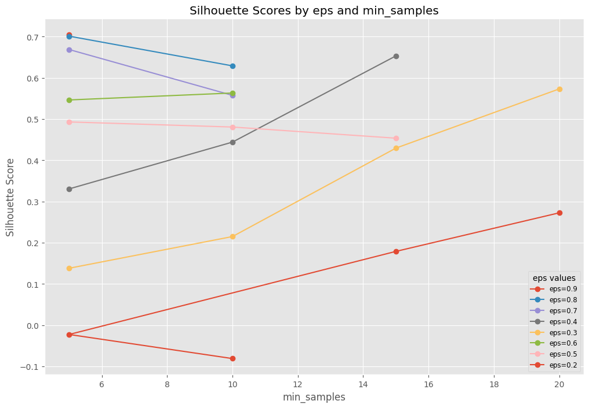
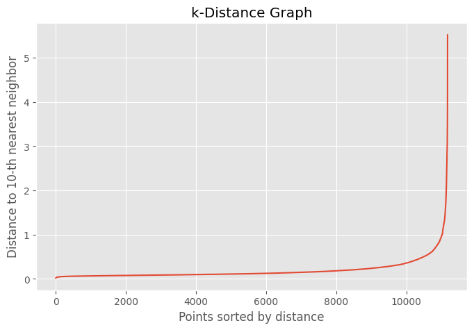

# 🍿 영화 데이터 기반 흥행 분류 및 수익 예측 통합 모델

## 📍 프로젝트 주제
영화 제작사와 투자자들이 개봉 전 흥행 가능성과 수익성을 사전에 판단하고 의사결정에 도움이 될 수 있는 맞춤형 모델을 개발


## 📍 모델 선정 배경

- 영화 산업에서는 개봉 전후로 수익을 예측하는 것이 매우 중요하므로 **수익을 예측하는 회귀 모델**을 구축
- 단순한 수익 예측뿐만 아니라, **손익분기점 기준으로 영화의 흥행 여부를 분류하는 모델**을 먼저 구축하여 흥행 여부를 사전 판단

하지만 단일 예측 모델만으로는 데이터 패턴을 충분히 반영하지 못할 가능성이 있음 
- 따라서, 더 정교한 예측을 위해 **클러스터링 모델을 구축하여 영화 데이터를 그룹화**한 후, 그룹별 특성을 고려한 개별 수익 예측 모델을 개발

---

## 📊 데이터셋 개요
- **출처**: (데이터셋이 출처한 사이트 또는 기관)
- **특징**: (데이터셋의 주요 컬럼 및 특성)

## 📍 데이터 전처리 과정

### 1. 사용하지 않는 feature 제거

### 2. 결측치 및 이상치 처리
  - 영화 ID(id) 기준으로 중복 행 제거
  - 결측치 제거
  - 이상치 제거
    - 0 값을 가지는 행
    - 예산(budget)과 수익(revenue)이 각각 1000 미만인 행

### 3. 특성 컬럼 추가
  - 물가 반영 금액 추가
  - 개봉 연도 추가
  - 수익률(ROI) 추가
  - 순수익(profit) 추가

### 4. 다중 레이블 인코딩
  - genres 데이터를 원-핫 인코딩 처리

### 5. 수치형 변수 스케일링
  - StandardScaler를 사용하여 `budget`, `popularity`, `vote_average`, `vote_count`등을 표준화

---

## 🏆 모델 및 성능 평가


### 📍 흥행 여부 분류 모델

1. #### 모델 선정
	  #### RandomForest & XGBoost
	RandomForest는 여러 개의 결정 트리를 학습하여 앙상블로 예측을 개선하고, XGBoost는 부스팅 방식으로 성능을 극대화합니다. 영화의 흥행 여부는 여러 요인이 복합적으로 작용하는데 두 모델 모두 복잡한 관계를 잘 다룰 수 있는 특징을 가지고 있어서 선택했습니다.
  
2. #### 데이터 추가 전처리
	```python
	df['success'] = df['ROI'].apply(lambda x: 1 if x >= 100 else 0)
	```
	영화 성공 여부를 분류하기 위해 ROI 값이 100 이상이면 성공(1), 그렇지 않으면 실패(0)로 간주하여 success 열에 저장합니다.

	```pyhon
	df.drop(['id','title','ROI','cast','director','adjusted_revenue','adjusted_budget','revenue','release_date','profit','popularity'],axis=1,inplace=True) 
	```
	불필요한 특성들을 제거하여 모델 학습에 필요한 정보만 남깁니다.</br>
  3. #### RandomForest 모델 튜닝
  - **최적 파라미터**:
    - `n_estimators`: **100,200,300,400,500,600** 으로 테스트  
    - `max_depth`: **3,4,5,6,7**로 테스트 </br> 
    - `n_estimators = 100`,`max_depth = 7` 이 설정에서 성능이 가장 우수함
    
- **특성 선택**:
  - `vote_average`, `vote_count`, `budget`, `genres`, `release_year`, `release_month`를 포함
  - 각 특성을 하나씩 제거해보았으나, 제거 시 모델 성능이 하락하여 모든 특성을 포함하는 것이 더 나은 결과를 얻었습니다.
	  
- **성능 평가**:


</br> 최적화 과정에서 과적합을 줄이기 위해 하이퍼파라미터 튜닝을 수행했습니다. 초기 모델에 비해 일반화 성능이 향상되었습니다.

 4. #### XGBoost 모델 튜닝
  - **최적 파라미터**:
    - `n_estimators`: 500부터 800까지 100 단위로 탐색
    - `max_depth`: 3부터 4까지 탐색
    - `learning_rate`: 0.01, 0.05, 0.1, 0.15, 0.2의 값을 실험
    - `subsample`:  0.7, 0.8, 0.9로 설정하여 샘플의 일부만 학습에 사용하여 과적합을 방지
    - `colsample_bytree`: 0.7, 0.8, 1.0. 각 트리를 학습할 때 사용할 특성(열)의 비율을 지정
    - `subsample = 0.7`, `n_estimators = 700`, `max_depth = 3`, `learning_rate = 0.01`, `colsample_bytree = 0.8` 에서 성능이 가장 우수했습니다.</br>
  - **특성 선택**:
    - RandomForest와 동일하게 진행했습니다.
     
- **성능 평가**:


</br> 최적화 과정에서 과적합을 줄이기 위해 하이퍼파라미터 튜닝을 수행했습니다. 초기 모델에 비해 일반화 성능이 향상되었습니다. 

### 최종 흥행 여부 분류 모델 선정  

| **모델**         | **Test F1 Score** | **5-fold 교차 검증 F1 Score** |
|------------------|------------------|-----------------------------|
| **RandomForest**  | 0.68             | 0.69                        |
| **XGBoost**       | 0.69             | 0.67                        |

교차 검증에서 **F1-score**가 가장 높았던 **RandomForestClassifier**를 최종 모델로 선정했습니다.  

#### ✅ 평가 지표 선정 이유  
- **투자자 관점(Precision)**: 수익성이 없는 영화를 성공으로 잘못 예측(False Positive)하면 큰 손실을 초래할 수 있어 정밀도가 중요합니다.  
- **제작사 관점(Recall)**: 성공 가능성이 있는 영화를 실패로 잘못 예측(False Negative)하면 기회를 놓칠 수 있어 재현율이 중요합니다.  
- **균형적 접근(F1-score)**: Precision과 Recall 간 균형을 맞추기 위해 최종 평가 지표로 사용했습니다.
  
</br>

</br></br>

### 📍 수익 예측 모델

1. ####  데이터 추가 전처리

2. #### 성능 평가

3.  #### 예측 결과

</br></br>

### 📍 클러스터링 모델
1. ####  클러스터링 모델 개발 이유
	영화 데이터 분석 시에 feature 간의 관계가 비선형적이고 복잡한 것을 알 수 있었음.
	이때, 클러스터링으로 수익과 연관이 있는 특성별로 데이터를 분리한 후 개별 회귀 모델을 생성하면 예측 정확도가 높아질 가능성이 있음.
	
2. #### 모델 선정
 - **K-Means** : 영화 데이터를 비슷한 특징을 가진 영화 그룹(예: 고수익 영화, 저예산 독립 영화)을 식별하는 데 적합
      
- **DBSCAN** : 밀도가 높은 클러스터를 형성하고, 이상치를 분리하여 분석
        
3. #### Feature 선정
	수익예측 모델에 훈련시킬 클러스터를 구분하는게 목적이기에 수익성에 따른 그룹을 군집화 하기 위해, revenue와 관련된 핵심 특성만 선택하여 훈련
	- `budget`, `popularity`, `vote_average`, `vote_count`, `genres`

4. #### 성능 평가
- 클러스터링 모델 평가
	| **클러스터링 모델** | **평가 지표** | **결과** | 
	|--------------------------|---------------|---------|
	| **K-Means** | Silhouette Score | 0.31 | 
	| **DBSCAN** | Silhouette Score | 0.70 | 

- K-Means 클러스터링을 활용하여 수익 예측 회귀 모델의 성능을 평가

   *평가 지표는 MSE, R2*
| **LinearRegression** | **RandomForestRegressor** | 
	|--------------------------|--------------------|
	|  |   |

- DBSCAN 클러스터링을 활용하여 수익 예측 회귀 모델의 성능을 평가

   *평가 지표는 MSE, R2*
	| **LinearRegression** | **RandomForestRegressor** | 
	|--------------------------|----------------------|
	|   |   | 


5. #### 성능 향상을 위해 노력한 점
- #### 특징 공학 : 차원 축소
  - 다중 레이블로 인코딩된 genres 특성을 포함한 데이터의 차원을 PCA를 통해 주요 3개의 차원으로 축소
  
	✔️ PCA 결과: 주요 차원이 전체 분산의 약 62%를 차지하므로, 데이터의 복잡성을 줄이는 데 성공

- **K-Means** 파라미터 튜닝 
  - 최적의 파라미터 (`n_clusters`)를 찾기 위해 **Elbow Method**와 **Silhouette Score**를 활용  

      

	1.  **엘보우 메서드 (왼쪽 그래프)**: k=3 근처에서 감소율이 완만해지는 경향이 보임
	2.  **실루엣 점수 (오른쪽 그래프)**:  k=2에서 가장 높은 점수를 보이지만,  k=3도 비교적 높은 점수를 유지

	✔️  최적의 클러스터 개수는  **3**

- **DBSCAN** 파라미터 튜닝
  - 최적의 파라미터 (`eps`, `min_samples`)를 찾기 위해 **k-거리 정렬**과 **Silhouette Score**를 활용  
	 
	   
	 ✔️ **eps = 0.9** : 모든  `min_samples`  값에서 가장 높은 실루엣 점수
 
      
	 ✔️ **min_samples = 5~10** : 그래프에서 급격한 변화가 나타나는 지점은 약 **5~10** 근처

6. #### 예측 결과

- #### K-Means 클러스터링을 활용한 수익 예측  
  - **Linear Regression**  
  
      
  
  - **Random Forest Regressor**  
  
      

- #### DBSCAN 클러스터링을 활용한 수익 예측  
  - **Linear Regression**  
  
      
  
  - **Random Forest Regressor**  
  
      
	 </br>

7. 결론
- 클러스터링을 적용한 후 회귀모델을 학습시키면 더 나은 성능을 보일 것이라고 예측했으나, 실제 결과는 그렇지 않았음.
- 클러스터링 모델의 성능이 회귀모델의 성능에 비례할 것이라고 예상했으나, 이 역시 성립하지 않았음.

✔️ 회귀모델과 클러스터링 알고리즘 간의 상호작용을 고려하여 하이퍼파라미터 튜닝 및 피처 엔지니어링 개선이 필요하다고 판단
	 
---

## 🚀 결론 및 향후 개선 방향
- (프로젝트에서 얻은 주요 인사이트와 앞으로의 발전 방향)
